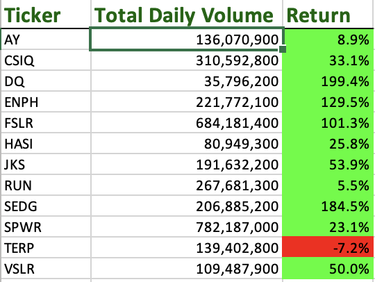
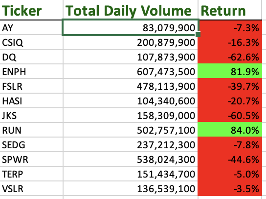

#Stock Analysis

##Overview
The purpose of this analysis is to help Steve's parents decide which stocks would be best for them to invest in. It calculates the total daily
volume for each stock as well as the return, first, making it clear which stocks did well and which did not. It also makes it easy to look at both
of these variables for the year 2017 or for the year 2018, allowing the Steve to compare the two.

##Results
As seen in the images below, almost all stocks did signifcantly better in 2017 as opposed to 2018. On average, stocks in 2017 produced a much higher return and higher total volumes. In 2018 the majority of stocks actually produced a negative return while in 2017, the majority produced a positive return. One stock however, actually did signifcantly better in 2018. RUN went from a 5.5% rate of return in 2017 to 84% in 2018.

 

As for exection times of the actual scripts, we can see clearly below that the original script (shown first) ran much more slowly than the refactored script (shown second).

 
 

